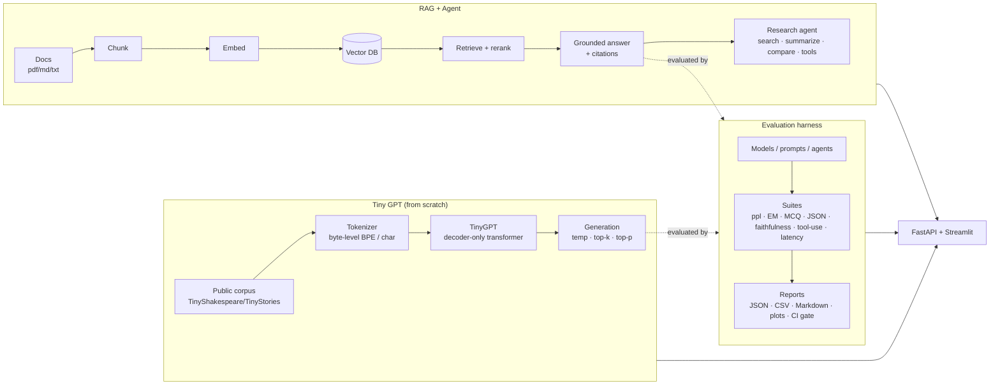

<div align="center">

# 🧠 Dork LLM

**An end-to-end LLM systems platform — train a tiny GPT from scratch, evaluate any model with a reusable harness, and answer questions over your documents with a cited RAG + agentic research assistant.**

[](https://github.com/srgangaram-swe/dork-llm/actions/workflows/ci.yml)
[](https://www.python.org/)
[](https://github.com/psf/black)
[](https://github.com/astral-sh/ruff)
[](https://mypy-lang.org/)
[](LICENSE)

*Local-first · reproducible · tested · honestly scoped.*

</div>

---

## Why this project exists

Most "LLM projects" are a single notebook calling an API. Real LLM/AI-systems work spans **three** disciplines that rarely appear together:

1. **Model internals** — can you actually *build* a transformer, not just call one?
2. **Evaluation** — can you measure whether a model is correct, grounded, safe, and fast *before* shipping?
3. **Applied systems** — can you turn a model into a grounded, cited product with retrieval and tools?

**Dork LLM** demonstrates all three in one cohesive, production-style codebase. It is deliberately **compact and educational-scale** — a few-million-parameter model on small public corpora — but engineered like real infrastructure: typed configs, a package + CLI, tests, CI, Docker, an API, and a dashboard. See [docs/limitations.md](docs/limitations.md) for an honest scope statement.

> **Not** a frontier model. **Yes** a faithful, end-to-end demonstration of the engineering that surrounds one.

## What it does

| Subsystem | What it proves | Key modules |
|---|---|---|
| 🏗️ **Tiny GPT from scratch** | Transformer internals: token/positional embeddings, causal multi-head attention, residual stream, weight tying, AdamW + cosine schedule, checkpointing, sampling | [`dork/models`](dork/models), [`dork/training`](dork/training), [`dork/generation`](dork/generation) |
| 📊 **Evaluation harness** | Pre-deployment measurement: perplexity, exact-match, MCQ, JSON validity, instruction-following, RAG faithfulness, tool-use, safety, latency — with CI gating | [`dork/evaluation`](dork/evaluation) |
| 🔎 **RAG + agent** | Grounded, cited answers over documents; an agent that searches, summarizes, compares, extracts claims, and uses tools — and refuses without evidence | [`dork/rag`](dork/rag), [`dork/agents`](dork/agents) |
| 🚀 **Serving** | FastAPI service + Streamlit dashboard over a shared service layer | [`apps/api.py`](apps/api.py), [`apps/dashboard.py`](apps/dashboard.py) |

## Architecture



A core design principle is **local-first with graceful fallbacks**: every subsystem has a zero-dependency path (a deterministic mock model, a hashing embedder, an in-memory vector store) so the whole platform runs and self-tests fully offline, then swaps in heavier backends (PyTorch, sentence-transformers, ChromaDB) for real use.

## Quickstart

```bash
# 1. Install (editable, all extras) and the git hooks
make install            # or: pip install -e ".[all]"

# 2. Run the offline self-test of the whole platform (no GPU, ~1 min)
make smoke

# 3. Train the tiny GPT, then generate
make train-tokenizer
make train-small-gpt
make generate                              # uses configs/train_tiny_gpt.yaml

# 4. Evaluate (writes JSON/CSV/Markdown + a plot to reports/)
make eval

# 5. Ingest the sample docs and ask a grounded question
make ingest-docs
make query-rag Q="What does causal masking prevent?"

# 6. Run the agent, the API, or the dashboard
make run-agent TASK="Summarize the transformers document"
make api                                   # http://localhost:8000/docs
make dashboard                             # http://localhost:8501
```

> No GPU? Everything runs on CPU. No network? Training falls back to a bundled public-domain corpus and the RAG/eval stack runs fully offline.

## Installation

Requires **Python 3.11+**. Dependencies are grouped into extras so you install only what you need:

```bash
pip install -e ".[train]"   # PyTorch + tokenizers (model training)
pip install -e ".[rag]"     # sentence-transformers + chromadb + pypdf
pip install -e ".[eval]"    # pandas + matplotlib (reports & plots)
pip install -e ".[serve]"   # fastapi + uvicorn + streamlit
pip install -e ".[all]"     # everything + dev tooling
```

## Make commands

| Command | Description |
|---|---|
| `make install` / `make smoke` / `make test` / `make lint` / `make format` / `make typecheck` | Dev workflow |
| `make train-tokenizer` / `make train-small-gpt` / `make generate` | Tiny GPT pipeline |
| `make eval` | Run the evaluation harness |
| `make ingest-docs` / `make query-rag Q=...` / `make run-agent TASK=...` | RAG + agent |
| `make benchmark` / `make benchmark_inference` / `make benchmark-inference` | Latency/throughput benchmark |
| `make api` / `make dashboard` | Serving |
| `make docker-build` / `make docker-run` | Containerized run |

Everything is also available via the `dork` CLI (e.g. `dork eval`, `dork query --question "…"`, `dork agent --task "…"`).

## Example outputs

## Training artifacts

Generated model artifacts are intentionally **not committed**:

| Artifact | Path | Regenerate with |
|---|---|---|
| raw downloaded corpus | `data/raw/` | `make prepare-data` |
| trained tokenizer | `tokenizers/tiny_gpt_bpe.json` | `make train-tokenizer` |
| tokenized bins + checkpoint | `artifacts/tiny_gpt/` | `make train-small-gpt` |
| vector store | `.chroma/` or configured store dir | `make ingest-docs` |
| eval reports and plots | `reports/` | `make eval` |

This keeps the public repo small and reviewable while preserving full regeneration commands.

## Example outputs

**Generation** (after a short local train; educational-scale, so expect Shakespeare-flavored but imperfect text):

```
PROMPT: To be, or not to be
OUTPUT: bar,
The son, 'tis not my face,
And I have I have in the taot and do.
```

**RAG answer** with citations:

```json
{
  "question": "What does causal masking prevent?",
  "answer": "In a decoder, causal masking prevents a position from attending to future positions. [1]",
  "citations": [{"marker": 1, "source": "data/sample_docs/transformers.md", "score": 0.71}],
  "refused": false
}
```

**Evaluation summary** (mock provider — a deterministic stub used for offline CI; real models replace it):

| Suite | Category | Metric | Value |
|---|---|---|---|
| exact_match | reasoning | accuracy | 1.00 |
| multiple_choice | reasoning | accuracy | 0.30 |
| json_validity | structured_output | valid_rate | 1.00 |
| rag_faithfulness | retrieval | faithfulness | 0.75 |
| tool_use | tool_use | tool_accuracy | 1.00 |
| safety_refusal | safety | behavior_accuracy | 1.00 |

A full, honest report (including failure cases) lives in [docs/example_eval_report.md](docs/example_eval_report.md).

## Local baseline

One local run in this workspace trained a smaller Tiny GPT profile and produced these honest baseline numbers:

| Metric | Value |
|---|---:|
| Parameters | 3,705,088 |
| Vocabulary | 2,048 |
| Training tokens | 388,613 |
| Training time | 1.49 minutes |
| Final train loss | 4.5095 |
| Final validation loss | 4.6829 |
| Train perplexity on 4k chars | 99.69 |

The checkpoint from that run is local-only and ignored by git; see [docs/model_card.md](docs/model_card.md).

## Documentation

| Doc | Contents |
|---|---|
| [docs/architecture.md](docs/architecture.md) | System design, data flow, design decisions |
| [docs/model_card.md](docs/model_card.md) | The tiny GPT: architecture, training, intended use, limits |
| [docs/eval_harness.md](docs/eval_harness.md) | Eval philosophy, suites, metrics, CI gating |
| [docs/rag_design.md](docs/rag_design.md) | Ingestion, chunking, embeddings, retrieval, citations |
| [docs/agent_design.md](docs/agent_design.md) | Agent loop, tools, safety, structured outputs |
| [docs/limitations.md](docs/limitations.md) | Honest scope, known weaknesses, future work |
| [docs/example_eval_report.md](docs/example_eval_report.md) | A sample evaluation report |
| [data/README.md](data/README.md) | Public-data policy and regeneration notes |
| [docs/github_issues_plan.md](docs/github_issues_plan.md) | GitHub labels, milestones, and issue bootstrap commands |
| [docs/portfolio_summary.md](docs/portfolio_summary.md) · [docs/resume_bullets.md](docs/resume_bullets.md) · [docs/linkedin_post.md](docs/linkedin_post.md) | Portfolio materials |

## Project layout

```
dork/            # core package: data, tokenizer, models, training, generation,
                 #               evaluation, rag, agents, serving, utils
apps/            # api.py (FastAPI) · dashboard.py (Streamlit)
scripts/         # CLI-equivalent entry points the Makefile calls
configs/         # typed YAML configs (train / eval / rag)
data/sample_docs # small public docs for the RAG demo
tests/           # unit + integration tests (pytest)
docs/            # architecture, model card, design docs, portfolio materials
```

## GitHub project management

The repository is prepared for GitHub labels, milestones, and professional issue tracking. If `gh` is authenticated, run the bootstrap commands in [docs/github_issues_plan.md](docs/github_issues_plan.md) to create the planned labels, milestones, and issues.

## Limitations (read this)

This is an **engineering-scale** project, not a frontier model. The GPT is millions (not billions) of parameters, trained on tiny public corpora; its generations are stylistically plausible but not factual or instruction-following at scale. The point is the **end-to-end systems engineering** — internals, evaluation, retrieval, agents, serving, tests, and reproducibility — done to a professional standard. Full detail in [docs/limitations.md](docs/limitations.md).

## License

MIT — see [LICENSE](LICENSE). Uses only public/synthetic data and open-source tools.
