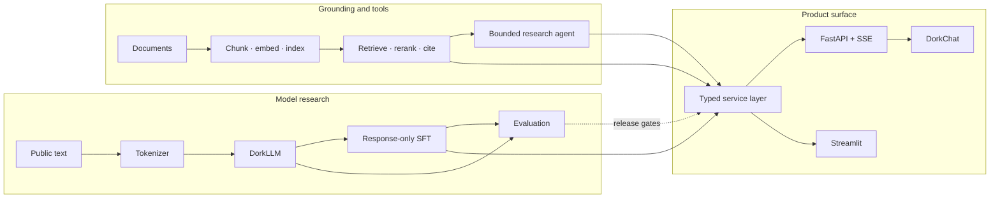

<div align="center">

# AxiomStack

### Proof. Probability. Production.

**A statistically rigorous, full-stack language-model lab: build DorkLLM from
first principles, measure it honestly, ground it in evidence, and ship it
through DorkChat.**

[](https://github.com/srgangaram-swe/dork-llm/actions/workflows/ci.yml)
[](https://www.python.org/)
[](https://github.com/psf/black)
[](https://github.com/astral-sh/ruff)
[](https://mypy-lang.org/)
[](LICENSE)

*Local-first · public-data only · reproducible · explicit about uncertainty*

</div>

## Why AxiomStack exists

Many LLM portfolios stop at a notebook or an API wrapper. AxiomStack treats a
language-model product as one connected technical system:

1. **Mathematical and model correctness** — explicit causal attention,
   next-token objectives, normalization, sampling, and cache invariants.
2. **Statistical evidence** — per-example evaluation, controlled experiments,
   regression gates, calibration and uncertainty on the roadmap.
3. **Production software** — typed boundaries, an API and streaming browser
   client, unit/integration/browser tests, CI, containers, and observability.

The model is intentionally small enough to inspect and train locally. This is
not a frontier-model claim. The point is to make the reasoning, evidence, and
engineering around the model reviewable end to end.

## The three product layers

| Layer | Role | What it demonstrates |
|---|---|---|
| **AxiomStack** | Platform and research workbench | Reproducible pipelines, evaluation, retrieval, APIs, CI/CD, and portfolio delivery |
| **DorkLLM** | From-scratch decoder model family | Causal attention, RoPE, RMSNorm, SwiGLU, GQA, QK normalization, KV caching, training, and SFT |
| **DorkChat** | Browser research cockpit | Streaming chat, runtime provenance, generation controls, evidence cards, accessibility, and responsive UX |

## System map



## What is implemented

| Capability | Evidence in the repository |
|---|---|
| Decoder-only transformer from explicit PyTorch components | [`dork/models`](dork/models) |
| Learned/sinusoidal/RoPE positions; LayerNorm/RMSNorm; GELU/SwiGLU | [`dork/models/layers.py`](dork/models/layers.py) |
| Multi-head or grouped-query attention, optional QK normalization, compact KV cache | [`dork/models/layers.py`](dork/models/layers.py), [`tests/test_model.py`](tests/test_model.py) |
| Causal pretraining and corrected next-token, response-only SFT | [`dork/training`](dork/training), [`tests/test_sft.py`](tests/test_sft.py) |
| Greedy, temperature, top-k and nucleus sampling | [`dork/generation`](dork/generation) |
| Evaluation suites for quality, structure, retrieval, tools, safety and latency | [`dork/evaluation`](dork/evaluation) |
| Source-grounded RAG with refusal and exact citation provenance | [`dork/rag`](dork/rag) |
| FastAPI, versioned streaming chat, runtime readiness and shared model routing | [`apps/api.py`](apps/api.py), [`dork/serving`](dork/serving) |
| Accessible DorkChat client plus frontend unit and Playwright tests | [`apps/web`](apps/web), [`tests/web`](tests/web), [`tests/e2e`](tests/e2e) |
| Python 3.11–3.13 CI, smoke training, web checks, and non-root container | [`.github/workflows/ci.yml`](.github/workflows/ci.yml), [`Dockerfile`](Dockerfile) |

## Quickstart

Requires Python 3.11 or newer.

```bash
git clone https://github.com/srgangaram-swe/dork-llm.git
cd dork-llm
python -m venv .venv
source .venv/bin/activate
make install
make check
```

Start DorkChat with an explicit deterministic demo provider:

```bash
make web-demo
# open http://127.0.0.1:8790
```

The UI labels this provider as a demo. It is never presented as a trained
DorkLLM. To chat through a local model, create the artifacts and run the strict
model-backed server:

```bash
make train-tokenizer
make train-small-gpt
make sft
DORK_MODEL_PATH=artifacts/tiny_gpt_sft make web
```

The runtime checks checkpoint/tokenizer compatibility and exposes the requested
provider, active provider, artifact, device, and degradation reason. Without a
compatible model, strict mode fails readiness instead of silently impersonating
one.

## Common workflows

```bash
# Model research
make train-small-gpt
make train-modern-small
make sft
make generate
make benchmark

# Evaluation and experiments
make eval
make scaling-study
make experiments

# Grounding and agents
make ingest-docs
make query-rag Q="What does causal masking prevent?"
make run-agent TASK="Compare RAG systems and evaluation"

# Product surfaces
make web
make web-demo
make dashboard
make api

# Verification
make check
make test-web
make test-e2e
```

Run `make help` for the full command list. The historical
`make train-frontier` name remains as a compatibility alias; documentation uses
**modern-small** because no frontier-scale claim is warranted.

## Model tracks

| Track | Purpose | Default artifact |
|---|---|---|
| Baseline | CPU-friendly GPT-2-style reference | `artifacts/tiny_gpt` |
| Baseline SFT | Response-only instruction-tuning experiment | `artifacts/tiny_gpt_sft` |
| Modern-small | RoPE + RMSNorm + SwiGLU + 8 query/2 KV heads + QK norm | `artifacts/dorkllm_frontier` |
| Modern-small SFT | Post-trained modern-small candidate | `artifacts/dorkllm_frontier_sft` |

Generated checkpoints, tokenizers, corpora, indexes, and experiment runs stay
out of git. Each artifact carries model configuration and training metadata;
runtime resolution reports exactly which artifact was selected.

## Evaluation and statistical scope

The current harness records per-suite results and supports deterministic
regression checks. Token-overlap F1 uses bounded multiset counts, and model tests
assert numerical parity between cached and reference causal paths.

The committed scaling plot is a small descriptive study, not a scaling-law
claim: it has too few configurations and seeds for strong inference. The
[statistical rigor milestone](https://github.com/srgangaram-swe/dork-llm/milestone/2)
tracks paired bootstrap/permutation inference, controlled multi-seed scaling,
calibration, risk-coverage analysis, and uncertainty-aware retrieval metrics.
That distinction is intentional—limitations are evidence, not footnotes.

## API surface

| Route | Purpose |
|---|---|
| `GET /health` | Process liveness and safe runtime summary |
| `GET /ready` | Model readiness; fails closed in strict mode |
| `GET /api/v1/model` | Requested/active provider, artifact, device and degradation metadata |
| `POST /chat` | Backward-compatible synchronous chat |
| `POST /api/v1/chat/stream` | Typed SSE conversation stream for DorkChat |
| `POST /generate` | Direct completion controls |
| `POST /rag/query` | Grounded answer with citations |
| `POST /evaluate` | Evaluation harness |
| `POST /agent/run` | Bounded research assistant |

Interactive OpenAPI documentation is available at `/docs` while the API is
running.

## Repository layout

```text
dork/              core model, training, evaluation, RAG, agent and service code
apps/api.py        FastAPI application factory and routes
apps/web/          DorkChat browser client
apps/dashboard.py  Streamlit research dashboard
configs/           typed training, evaluation and retrieval configurations
scripts/           reproducible command-line entry points
tests/             Python unit and integration tests
tests/web/         frontend unit tests
tests/e2e/         Playwright browser integration
docs/              architecture, model card, limitations and delivery roadmap
```

## Delivery roadmap

The live plan contains five milestones and 26 assigned work items spanning the
vertical slice, statistical rigor, deep-learning systems, a grounded production
platform, and the v1.0 public release. See
[`docs/github_issues_plan.md`](docs/github_issues_plan.md) or the
[GitHub milestones](https://github.com/srgangaram-swe/dork-llm/milestones).

Development flows from short-lived branches to `dev`, then promotes through
`main` and `prod` by pull request.

## Honest limitations

- DorkLLM is millions of parameters trained on small public corpora. It is not a
  general factual assistant.
- A local checkpoint is not committed; strict chat requires training or mounting
  one.
- The deterministic demo provider exists for offline CI and UI exploration, not
  model-quality claims.
- The current datasets and experiments are too small to certify safety or
  production readiness.
- Administrative evaluation, ingestion, and agent routes are local research
  surfaces; public deployment needs the controls tracked in issue #23.

Read the full [`docs/limitations.md`](docs/limitations.md) and
[`docs/model_card.md`](docs/model_card.md) before interpreting results.

## License and data policy

MIT licensed. The checked-in datasets are synthetic or public-safe. No employer,
classified, proprietary, or sensitive data is required or included.
