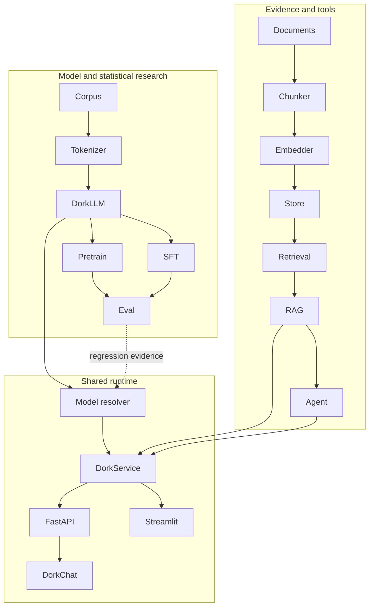
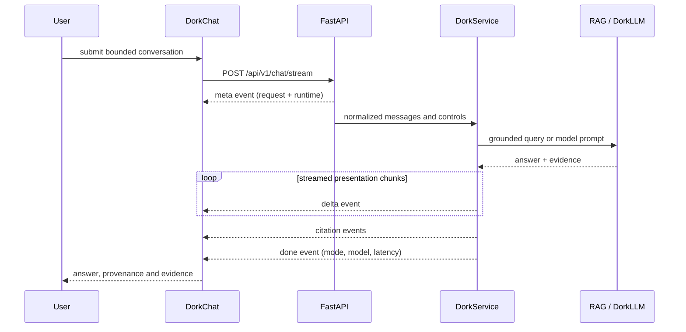

# AxiomStack architecture

AxiomStack connects three concerns that are often separated in portfolio work:
model research, statistical evaluation, and product delivery. DorkLLM is the
model family; DorkChat is one client of a shared typed service layer.

## System context



## Package boundaries

| Package | Responsibility |
|---|---|
| `dork.data` | Public-corpus preparation and memory-mapped token batches |
| `dork.tokenizer` | Character and byte-level BPE implementations behind one interface |
| `dork.models` | DorkLLM attention, normalization, MLP blocks, model and cache |
| `dork.training` | Pretraining, causal SFT, schedules, exact checkpoint payloads |
| `dork.generation` | Sampling, tokenizer/model bridge and provider abstraction |
| `dork.evaluation` | Registered suites, bounded metrics, reports and gates |
| `dork.rag` | Provenance-preserving ingestion, retrieval, reranking and citations |
| `dork.agents` | Bounded tools and inspectable execution trajectories |
| `dork.serving` | Runtime settings, model resolution, shared state, schemas and metrics |
| `dork.pipelines` | CLI/script orchestration for reproducible offline workflows |

`apps/api.py`, `apps/dashboard.py`, and `apps/web/` are delivery adapters. Model,
retrieval, and evaluation policy stays below those adapters.

## DorkLLM attention path

Each block is pre-normalized and preserves a single residual stream:

```text
x = x + drop_path(attention(norm(x)))
x = x + drop_path(mlp(norm(x)))
```

The attention projection supports standard multi-head attention or grouped-
query attention. With `n_head=8` and `n_kv_head=2`, eight query heads share two
key/value heads. Keys and values remain compact in the cache and expand only for
the attention operation. Optional per-head QK RMS normalization accumulates in
float32 for half-precision stability.

Cached multi-token chunks need an absolute-position mask. PyTorch's built-in
non-square causal mask is upper-left aligned, so AxiomStack constructs an
offset-aware boolean mask whenever a chunk is appended to a prefix. Tests compare
full prefill, chunked cache, one-token cache, fused SDPA, and the explicit
masked-softmax path.

## Training objectives

Pretraining forms conventional shifted token windows. SFT constructs one joined
instruction/response sequence, then uses `sequence[:-1]` as input and
`sequence[1:]` as labels. Targets before the first response token and padded
positions receive the ignore index. This makes the final prompt position predict
the first response token and prevents same-position identity learning.

Checkpoint payloads contain model configuration, state, optimizer state,
training step, validation loss, tokenizer path, and stage metadata. Generated
artifacts remain outside git.

## Model runtime and readiness

Serving settings are read once at the boundary. Resolution considers an explicit
artifact first, then modern-small SFT, modern-small base, baseline SFT, and
baseline base candidates. Every local candidate must pass checkpoint and
tokenizer compatibility validation.

Strict mode reports not-ready when the requested provider cannot load. The
deterministic mock exists only in explicit demo mode. Readiness metadata includes
requested and active provider, model name, artifact, device, and a safe
degradation reason. The same selected `LanguageModel` instance is injected into
RAG, so direct and grounded paths cannot silently use different providers.

## DorkChat request lifecycle



The legacy `/chat` JSON endpoint remains for compatibility. DorkChat prefers the
versioned SSE endpoint, uses `AbortController` for cancellation, and falls back
only when streaming is unavailable. Browser history is bounded and persisted
locally; the server validates item counts and content lengths again at the trust
boundary.

## Retrieval provenance

Documents become chunks with source paths and exact character offsets. Retrieval
returns scored chunks, reranking is deterministic, and citations map answer
markers to source, chunk id, snippet and score. A minimum evidence threshold can
force refusal. Current citation checks validate marker mapping and heuristic
overlap; claim-level entailment is future work.

## Verification strategy

| Layer | Checks |
|---|---|
| Pure math/utilities | Sampling, F1 bounds, schedules, configuration validators |
| Model | Shape, objective, GQA/cache width, causal parity, checkpoint compatibility |
| Service | Injected providers, resolution failures, shared RAG model, readiness, metrics |
| API | Pydantic bounds, legacy JSON contract, SSE event order and safe errors |
| Browser | Pure state/stream utilities, responsive chat flow and accessibility semantics |
| System | Tiny training/checkpoint smoke and browser-to-API integration |

CI exercises Python 3.11, 3.12 and 3.13 for pull requests and pushes involving
`dev`, `main`, or `prod`. API dependencies are installed explicitly so tests
cannot pass through `importorskip`. The container uses a separate build stage,
an allowlisted copy context, and a non-root runtime user.

## Delivery topology

```text
short-lived branch -> dev -> main -> prod
```

Feature work integrates through `dev`. Stable portfolio promotion goes from
`dev` to `main`; deployment promotion goes from `main` to `prod`. Branch tips
are ancestry-checked before short-lived branches are deleted. The live roadmap
and acceptance criteria are documented in
[`github_issues_plan.md`](github_issues_plan.md).
